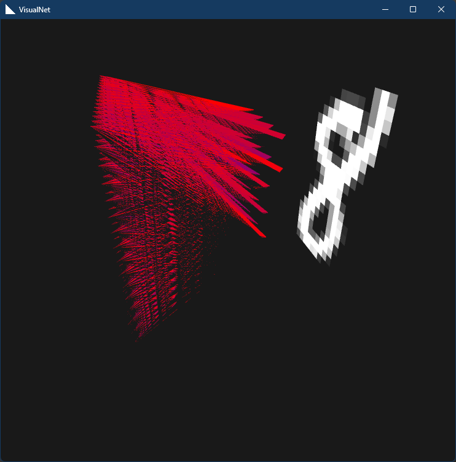

# VisualNet

This is a visual simulation of a working Deep Neural Network (Multilayer Perceptron to be precise). \
The goal of this simulation is to demonstrate an almost 100% GPU usage:
> The computation and rendering both will be covered by the same GPU and data will stay inside VRAM.

**It's broken.** The scope is big and I am lazy..

Started out this project with Java, then moved to Go. \
The low level libraries are too slow and painful to compile in windows, I think I regret switching to Go.

Here is a screenshot:
